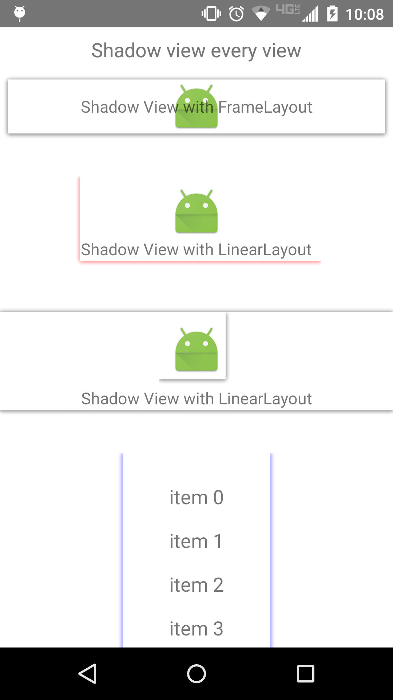

# ShadowViewHelper
Shadow layout, shadow view for android.



# How to use：
`It's very simple to use.`
### Gradle([Check newest version](http://search.maven.org/#search%7Cga%7C1%7CShadowViewHelper)):
```groovy
compile 'com.github.wangjiegulu:ShadowViewHelper:x.x.x'
```
### Maven([Check newest version](http://search.maven.org/#search%7Cga%7C1%7CShadowViewHelper)):
```xml
<dependency>
    <groupId>com.github.wangjiegulu</groupId>
    <artifactId>ShadowViewHelper</artifactId>
    <version>x.x.x</version>
</dependency>
```
### xml:
```xml
<LinearLayout
      android:id="@+id/activity_main_shadow_view"
      android:layout_width="wrap_content"
      android:layout_height="wrap_content"
      >
</LinearLayout>
```
### Activity:
```java
// all side shadow
ShadowProperty sp = new ShadowProperty()
        .setShadowColor(0x77000000)
        .setShadowDy(dip2px(this, 0.5f))
        .setShadowRadius(dip2px(this, 3))
        .setShadowSide(ShadowProperty.ALL);
ShadowViewDrawable sd = new ShadowViewDrawable(sp, Color.WHITE, 0, 0);
ViewCompat.setBackground(shadowViewA, sd);
ViewCompat.setLayerType(shadowViewA, ViewCompat.LAYER_TYPE_SOFTWARE, null);

// only all sides except top shadow
ShadowProperty sp = new ShadowProperty()
        .setShadowColor(0x770000FF)
        .setShadowDy(dip2px(this, 0.5f))
        .setShadowRadius(dip2px(this, 3))
        .setShadowSide(ShadowProperty.LEFT | ShadowProperty.RIGHT | ShadowProperty.BOTTOM);
ShadowViewDrawable sd = new ShadowViewDrawable(sp, Color.TRANSPARENT, 0, 0);
ViewCompat.setBackground(shadowViewD, sd);
ViewCompat.setLayerType(shadowViewD, ViewCompat.LAYER_TYPE_SOFTWARE, null);
```


License
=======

    Copyright 2015 Wang Jie

    Licensed under the Apache License, Version 2.0 (the "License");
    you may not use this file except in compliance with the License.
    You may obtain a copy of the License at

       http://www.apache.org/licenses/LICENSE-2.0

    Unless required by applicable law or agreed to in writing, software
    distributed under the License is distributed on an "AS IS" BASIS,
    WITHOUT WARRANTIES OR CONDITIONS OF ANY KIND, either express or implied.
    See the License for the specific language governing permissions and
    limitations under the License.

[](http://android-arsenal.com/details/1/1884)
